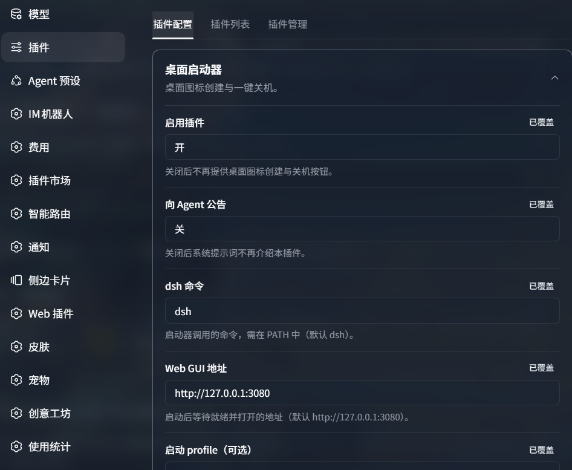
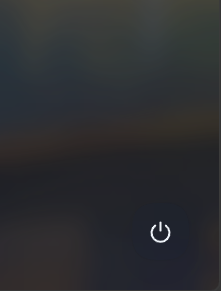

# dsh-desktop-launcher2

> Desktop launcher + one-click shutdown plugin for DeepSeek Harness: create a desktop icon from the Web settings page (double-click to start `dsh web`), with a WPF-style startup popup; plus a floating power button at the bottom-right that exits dsh gracefully after confirmation.

[中文](README.md) · **English**

<!-- Repo Topics suggestion (add on the GitHub repo page: About → Topics):
     dsh · dsh-plugin · deepseek-harness · desktop-launcher · shutdown · powershell -->

## ⚡ Install (copy this single line)

```powershell
dsh plugin --profile web add github:H1Kariiiiiii/dsh-desktop-launcher2
```

> That's all: dsh pulls the source from GitHub, installs it, and **auto-adds it to your profile's bundles layer** — no manual file edits. Then restart with `dsh web`.

(If `dsh` isn't installed yet: `npm i -g @deepseek-ai/dsh`. If the `github:` form fails on your pnpm version, use `dsh plugin --profile web add git+https://github.com/H1Kariiiiiii/dsh-desktop-launcher2.git`.)

## Features

### Desktop icon (core)
- A "Create desktop icon" button on the settings page creates `DeepSeek-Harness.lnk` on your Desktop (Windows).
- Double-click behavior:
  1. Probes `http://127.0.0.1:3080` for a running dsh instance.
  2. If not running, shows a **DeepSeek-Harness-styled startup popup** (dark rounded WPF card + spinner + status text) while starting `dsh web` in the background.
  3. Polls for up to 60 seconds, then opens the browser once ready.
- Icon/scripts live in `~/.dsh/desktop-launcher/` (`launcher2.ps1` + `.lnk` + icon assets).

### One-click shutdown
- A **floating power button** at the bottom-right of the page (circular icon).
- Click → confirmation dialog (configurable to exit directly without confirm).
- On confirm → `POST /api/dsh-desktop-launcher2/shutdown` → `ctx.appExit` **graceful exit** (plugin tree is disposed first; falls back to `process.exit(0)` if `appExit` is absent).
- The browser receives the acknowledgement before the process goes away, avoiding a dead-server error page.

### Configuration (Settings → Plugins → Plugin configuration → Desktop launcher)
| Field | Default | Description |
|---|---|---|
| Enable plugin | `true` | When off, desktop icon creation and the shutdown button stop. |
| Announce to agent | `false` | When off, the system prompt no longer introduces this plugin. |
| dsh command | `dsh` | Command the launcher calls; must be on PATH. |
| Web GUI URL | `http://127.0.0.1:3080` | Address the launcher waits for and opens. |
| Startup profile (optional) | empty | Leave blank to start `dsh web` without a `--profile` argument. |
| Icon file (optional) | empty | `.ico/.png` path for the desktop icon; blank uses the bundled dsh icon. |
| Confirm before exit | `true` | When off, the power button exits immediately without a confirm dialog. |

Config is written to the `desktop-launcher` section of `~/.dsh/settings.yaml` (shared with the official settings panel, persists after restart).

## Screenshots

**Settings card (Settings → Plugins → Plugin configuration → Desktop launcher)**



**Floating shutdown button at the bottom-right**



## Installation

> Requires [dsh](https://www.npmjs.com/package/@deepseek-ai/dsh) (`dsh web` must start). `dsh plugin add` detects the package declares `dsh.bundle` and **auto-adds it to the profile's bundles layer** — no manual file editing; just restart `dsh web` after install.

### Recommended: install from GitHub

```powershell
# Install
dsh plugin --profile web add github:H1Kariiiiiii/dsh-desktop-launcher2

# Restart
dsh web
```

> Pure JS package (no build step), works directly from GitHub. If the `github:` form fails on your pnpm version, use `git+https://github.com/H1Kariiiiiii/dsh-desktop-launcher2.git`.

### Development / internal: install from local source

```powershell
# Clone or unzip the repo anywhere, then install with an absolute file: path
dsh plugin --profile web add "file:C:/path/dsh-desktop-launcher2"

# Restart
dsh web
```

> Note for local `file:` dependencies: pnpm **copies** the package (not a link) across drives, so after editing source, re-run `dsh plugin --profile web add "file:C:/path/dsh-desktop-launcher2"` (or delete `node_modules/dsh-desktop-launcher2` then `pnpm install`) to sync.

### Verify after install

```powershell
# 1) Confirm the plugin is in the composed layer (should see the dsh-desktop-launcher2 section)
dsh --profile web --dump-config | Select-String "dsh-desktop-launcher2"

# 2) Start dsh web, open Settings → Plugins → Plugin configuration → Desktop launcher:
#    - Click "Create desktop icon" → a DeepSeek-Harness.lnk appears on the Desktop
#    - A ⏻ floating shutdown button should appear at the bottom-right
```

### Uninstall

```powershell
dsh plugin --profile web remove dsh-desktop-launcher2
# Then restart dsh web; the desktop shortcut and ~/.dsh/desktop-launcher/ scripts can be deleted manually
```

## Compatibility

Tested against **rc.1** at runtime:

| Layer | Status |
|---|---|
| Host routes (`ctx.webServer.register`, exact) | ✅ Stable (core API) |
| Settings registration (`installSection` / `register` dual path) | ✅ Feature-detected, degrades when absent |
| `ctx.appExit` | ✅ Optional read, `process.exit` fallback |
| `ctx.systemPrompt` | ✅ Optional read, only used when announcement is on |
| Client bundle protocol (`window.__ModuleLoader__.load` lazy CJS) | ⚠️ Private protocol, may change with dsh versions |
| Client slot (`settings.plugin.item`, keyed) | ⚠️ Contract details (key must equal settings namespace) may change |
| Desktop shortcut (`launcher2.ps1`) | ✅ Standalone PowerShell, independent of plugin liveness |

**Degradation guarantee**: even if the client UI breaks entirely, `launcher2.ps1` still starts `dsh web` on its own (it only calls the `dsh` command).

Verified on: host `dsh 0.1.2-rc.1`, Node v24.19.0, Windows PowerShell 5.1+.

## FAQ

**Q: Saving settings errors with `settings namespace "desktop-launcher" is not registered`?**
A: The settings service may not have been ready when the plugin applied; the route layer lazy-registers before writing (detects and registers before POST). If it still appears, restart dsh (host registration requires a restart).

**Q: The plugin configuration card doesn't show up?**
A: Confirm both: ① host registration succeeded (`desktop-launcher:` exists in `~/.dsh/settings.yaml`); ② the card key equals the namespace (this plugin registers as `desktop-launcher`). Refresh the page after both; host code changes require a restart.

**Q: Opening the desktop icon shows 401 (authentication required)?**
A: This is rc.1's browser auth (per-process random token). The launcher script lets dsh open the token-carrying browser itself; if dsh is already running and the browser lost its cookie, restart dsh so it re-opens the authenticated URL.

**Q: Source changes don't apply after restart?**
A: `file:` deps are **copied** (not linked) across drives; re-run `add` or delete the `node_modules` copy and reinstall (see "Development / internal" above).

## Background

- `@linxin666/dsh-desktop-launcher` is a standalone npm package (repo [zhu1090093659/dsh-web](https://github.com/zhu1090093659/dsh-web)), latest 0.3.13 (2026-09-03), still maintained.
- The aggregate `@linxin666/dsh-web-all` **bundled it as a dependency from 0.3.3 → 0.3.13**; **it was removed from the aggregate dependencies starting 0.3.14** (0.3.14/0.3.15/0.3.16 have no `desktop-launcher` in `dependencies` or `exports`).
- This project is ported from the **0.2.8 source** (leftover in local `.pnpm_patches`; that version's `@deepseek-ai/dsh-client-runtime` dependency does not exist in rc.1). Note: the original package 0.3.9+ switched to `dsh-client-store`/`dsh-client-ui-renderer` etc. to support alpha.2+; 0.3.13 requires `dsh >= 0.1.2-alpha.4` and could theoretically be installed. This project chose to re-implement standalone rather than depend on the original package.
- Repo code: plain ESM JavaScript (no TS/JSX; client bundle uses the `window.__ModuleLoader__.load` lazy-CJS factory), adapted for DeepSeek Harness **0.1.2-rc.1** (Windows).

## Structure

```
dsh-desktop-launcher2/
├── lib/
│   ├── index.js        # host entry: routes, settings registration, announcement
│   ├── client.js       # client bundle: settings card + floating shutdown button
│   └── host/state.js   # launcher script generation (PowerShell / POSIX)
├── assets/             # dsh.ico / dsh.png (bundled icons) + screenshots/
├── cordis.patch.yml    # bundle patch layer
├── package.json        # plugin manifest (file: loading)
└── LICENSE             # Apache-2.0
```

## Credits

- Functionality and UI ported from `@linxin666/dsh-desktop-launcher@0.2.8` (Apache-2.0) in the [zhu1090093659/dsh-web-ui](https://github.com/zhu1090093659/dsh-web-ui) repository. The launcher popup, shortcut installer, and floating shutdown button designs come from that package, rewritten as plain ESM JavaScript against the `dsh 0.1.2-rc.1` API.
- Icon assets (`dsh.ico`/`dsh.png`) are from the original package.

## License

[Apache-2.0](LICENSE) (same as the original; code includes ported parts with original copyright notices retained).
